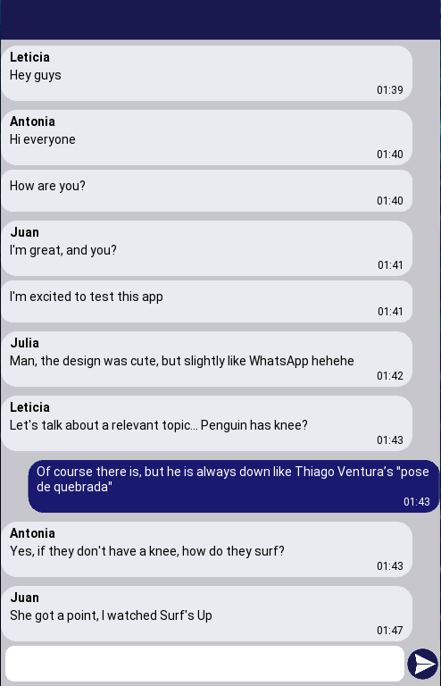
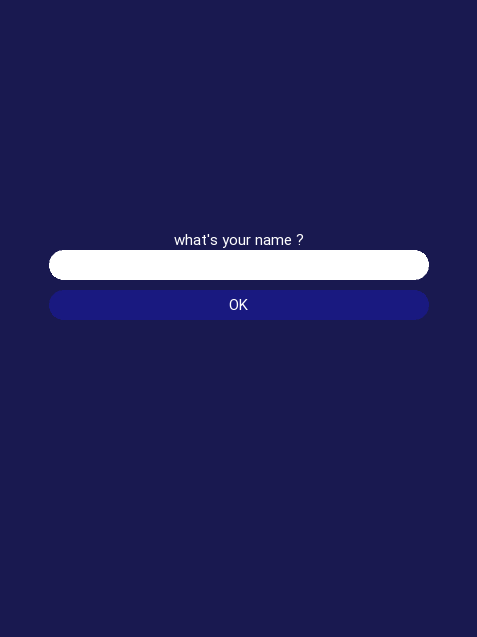
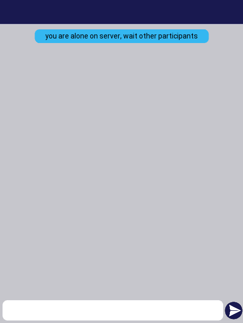

# Message py
Message is a chat application developed 100% in python.
## Proposal
the initial purpose of this project was to put my knowledge into practice about the following area:
* Distributed Systems
* Cryptography
* Graphic Interface
## Solution
I developed a chat that consists of one server and multiple clients. Each client is a application with a graphical interface. Finally every message between client and server are ciphed.

## setup
To run and test this solution you need:
1. Clone this repository.
2. Open the repository folder on terminal.
3. Run
    $ python -m venv venv, 
to create a python virtual environment.
4. Run
    $ source venv/bin/activate,
to activate venv.
5. Run
    $ python -m pip install -r requirements.txt,
to install python dependencies.
6. Run
    $ python client/client.py &,
to start client running in background. You can run this code as much as you want to create some clients.
7. Run
    $ python server/server.py,
to start server.
8. fill in the name of each client, click Ok and enjoy.  

**OBS 1:** I like to start running the clients in background and then run server in foreground to use only one terminal. But doing like me, is important fill in the name of clients only after start server.  
**OBS 2:** You can run
    $ deactivate,
To stop python virtual environment.  

## Distributed Systems
I developed client-server comunication with "Socket" and "Selectors" python modules.

## Cryptography
For doing this i developed some cryptography methods keeped on "cryptography" folder, I used "cryptography" python module.  
**Note:** This methods is not secure.

## Graphic Interface
I developed client interface with "Kivy" python module.
 
**Image 1** - Initial page.  
**Image 2** - Chat page.

